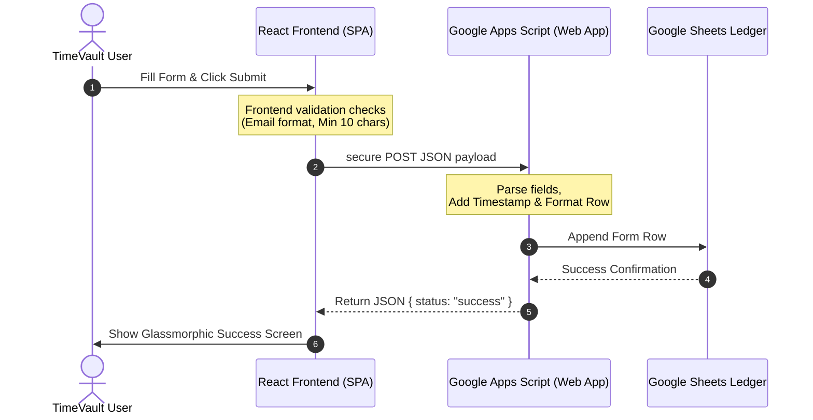

# TimeVault Contact & Feedback System Setup Guide

This guide explains how to connect your TimeVault Contact & Feedback form directly to **Google Sheets** using a lightweight, secure, and serverless **Google Apps Script** integration. 

No backend database configurations or paid email providers are required. All user submissions will append directly to a private spreadsheet in real-time.

---

## 📊 How the System Works



---

## 🛠️ Step-by-Step Configuration

### Step 1: Create Your Google Spreadsheet
1. Open [Google Sheets](https://sheets.google.com) and create a **Blank Spreadsheet**.
2. Rename the spreadsheet to `TimeVault Contact & Feedback Ledger`.
3. In the first row (Header Row), create the following columns in exactly this order:
   * **Column A**: `Timestamp` 📅
   * **Column B**: `Name` 👤
   * **Column C**: `Email` ✉️
   * **Column D**: `Category` 🏷️
   * **Column E**: `Priority` ⚡
   * **Column F**: `Subject` 📝
   * **Column G**: `Message` 💬
4. (Optional) Highlight the header row and click **View** -> **Freeze** -> **1 row** to lock headers.

---

### Step 2: Open and Write Google Apps Script
1. In your Google Sheet menu bar, click **Extensions** ➔ **Apps Script**.
2. Delete any default code in the editor (the empty `myFunction` block).
3. Copy and paste the following production-grade Apps Script code into the editor:

```javascript
/**
 * TimeVault Serverless Contact Ledger API
 * Built for premium zero-knowledge cross-origin form logging.
 */

function doPost(e) {
  try {
    // Parse the JSON payload sent by the React frontend
    var data = JSON.parse(e.postData.contents);
    
    // Server-side validation
    if (!data.name || !data.email || !data.message) {
      return ContentService.createTextOutput(JSON.stringify({
        status: "error",
        message: "Missing required fields (Name, Email, or Message)."
      }))
      .setMimeType(ContentService.MimeType.JSON);
    }
    
    // Open the active spreadsheet and select the primary sheet tab
    var sheet = SpreadsheetApp.getActiveSpreadsheet().getActiveSheet();
    var timestamp = new Date();
    
    // Map values into a clean row matching column configurations
    var rowData = [
      timestamp,
      data.name.trim(),
      data.email.trim(),
      data.feedbackType || "general",
      data.priorityLevel || "low",
      data.subject ? data.subject.trim() : "No Subject",
      data.message.trim()
    ];
    
    // Append the row securely
    sheet.appendRow(rowData);
    
    return ContentService.createTextOutput(JSON.stringify({
      status: "success",
      message: "Submission appended successfully."
    }))
    .setMimeType(ContentService.MimeType.JSON);
    
  } catch (error) {
    return ContentService.createTextOutput(JSON.stringify({
      status: "error",
      message: "Server exception: " + error.toString()
    }))
    .setMimeType(ContentService.MimeType.JSON);
  }
}
```

4. Click the **Save** disk icon (or press `Ctrl + S` / `Cmd + S`).
5. Rename the Apps Script project to `TimeVault Contact API`.

---

### Step 3: Deploy the Script as a Web App
To allow the TimeVault frontend to invoke this script publicly, it must be deployed as a Web App.

1. In the top-right corner of the Apps Script dashboard, click **Deploy** ➔ **New deployment**.
2. Click the gear icon (**Select type**) and select **Web app**.
3. Configure the following deployment fields:
   * **Description**: `TimeVault Contact Form Web App v1`
   * **Execute as**: Select **Me (your_email@gmail.com)**. *(This gives the script permission to write rows on your behalf)*.
   * **Who has access**: Select **Anyone**. *(This is vital; selecting "Anyone with a Google account" or "Only myself" will cause the frontend to receive CORS/Authorization errors)*.
4. Click **Deploy**.
5. Google will prompt you to **Authorize Access**:
   * Click **Authorize Access** and select your Google account.
   * Click **Advanced** ➔ **Go to TimeVault Contact API (unsafe)** *(This is standard for custom Apps Scripts; Google warns because you are authorizing your own script to access your spreadsheet)*.
   * Review permissions and click **Allow**.
6. Under **Web app**, copy the **URL**. It will look similar to this:
   `https://script.google.com/macros/s/AKfycbz_XXXXXXXXXXXXXX_YYYYYYYYYYYYYY/exec`

---

### Step 4: Configure Frontend Environment Variables
1. Open the `.env` file at the root of your TimeVault codebase.
2. Add a new line or edit the existing placeholder with your copied script URL:

```env
VITE_CONTACT_APPS_SCRIPT_URL=https://script.google.com/macros/s/AKfycbz_XXXXXXXXXXXXXX_YYYYYYYYYYYYYY/exec
```

3. Save the `.env` file.
4. **Important**: Restart your Vite development server (`npm run dev`) to load the new environment variable into memory.

---

## 🧪 Testing Your Setup

### 1. From the Frontend
1. Launch the TimeVault application and navigate to the **Contact** page.
2. Verify the status indicator says **"Spreadsheet Live"** 🟢.
3. Fill out the name, email, subject, feedback type, and a message longer than 10 characters.
4. Click **Save Log to Google Spreadsheet**.
5. The button will display the "Logging in Google Sheet..." spinner, and within 1–2 seconds, transition to the slide-up **Success Screen**.
6. Open your Google Sheet. You should immediately see the timestamped row populated with the data you entered!

### 2. Testing via Terminal Command (curl)
If you want to test the Apps Script directly without using the browser:
```bash
curl -X POST -H "Content-Type: text/plain" -d "{\"name\":\"Test User\",\"email\":\"test@test.com\",\"subject\":\"CLI Test\",\"feedbackType\":\"bug\",\"priorityLevel\":\"high\",\"message\":\"This is a 10+ character command line test message.\"}" YOUR_WEB_APP_URL
```

---

## 🔒 Security & Spam Prevention Recommendations

Google Sheets is a highly lightweight solution. To prevent abuse and protect your spreadsheets in production:

1. **Frontend Length & Format Enforcement**: 
   * The TimeVault form automatically rejects any submissions failing standard email format matching.
   * The message length is strictly locked between **10** and **2000** characters on the client-side to prevent memory-injection payloads.
2. **Apps Script Payload Filters**:
   * The provided script validates required fields before attempting sheet operations. If an attacker bypasses the frontend, the serverless endpoint rejects incomplete JSON payloads.
3. **Honeypot Captcha (Recommended for public websites)**:
   * To block automated headless spam bots, add a hidden honeypot input in your form (e.g. `<input type="text" name="website" className="hidden" />`). 
   * If a bot fills this hidden field during submission, abort the POST request.
4. **Re-deploying Updates (Important Apps Script Rule)**:
   * Google Apps Script version caches deployments. **If you modify the Google Apps Script code, you must re-deploy it**:
     1. Click **Deploy** ➔ **Manage deployments**.
     2. Click the **Pencil icon (Edit)**.
     3. Under **Version**, select **New version**.
     4. Click **Deploy**. *(Failing to do this means Google will keep executing your old script version!)*.

---

## 🛠️ Troubleshooting & CORS Resolving

### Issue 1: Submissions trigger the "Error" screen or CORS blocker
* **Cause**: This happens if the deployment access configuration was not set to "Anyone".
* **Solution**: Go back to Extensions ➔ Apps Script. Click Deploy ➔ Manage Deployments. Edit the active deployment, ensure **Who has access** is set to **Anyone**, and click Deploy.

### Issue 2: Script compiles correctly but Spreadsheet remains blank
* **Cause**: The Sheet was created under a separate Google account from the Apps Script, or the Apps Script was not granted writing permissions during the oauth consent modal.
* **Solution**: Ensure your Apps Script menu is launched directly from Extensions ➔ Apps Script *inside* the specific Spreadsheet sheet container. This couples them together automatically.

---

## 📈 Monitoring Submissions

* **Instant Email Notifications**: Open your sheet, click **Tools** ➔ **Notification settings** ➔ **Edit notifications**. Set notifications to send you a digest email whenever a user submits form entries.
* **Color Categorization**: Use Google Sheets **Conditional Formatting** to highlight rows based on **Priority Level** (e.g. automatically paint "critical" rows light red, "medium" rows light blue) for rapid engineering triage.
