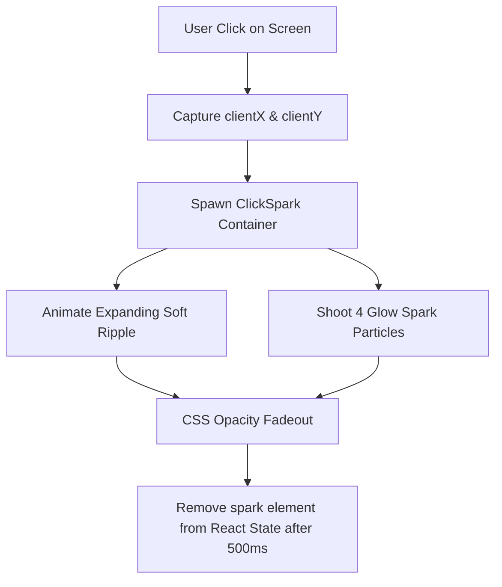

# TimeVault Visual Polish & Premium UI/UX Guide

This document highlights the newly added premium animations, global interactive click effects, redesigned legal architectures, and visual enhancements integrated into the **TimeVault** SaaS web application.

---

## ⚡ Premium Click Spark Effect

To elevate the tactile feedback of the TimeVault user experience, we designed a global, hardware-accelerated **Mouse Click Spark Effect** embedded inside [__root.jsx](file:///e:/My%20Projects/Projects/timevault/src/routes/__root.jsx).

### Technical Blueprint & Performance Measures:
1. **Passive Event Listeners**: Attaches `window.addEventListener('mousedown', handler, { passive: true })` globally. Passive flag tells the browser the event won't block scroll rendering, preserving 60+ FPS scrolling.
2. **Strict Memory Capping**: The click sparks state is bounded using `.slice(-8)` in React state. This guarantees that rapidly spamming clicks will never cause memory leaks or frame rate stutters, capping active DOM particles to exactly 8.
3. **GPU-Accelerated Transforms**: Ripple and sparks animate strictly using CSS `transform` (scale, translate) and `opacity` properties. These properties avoid expensive layout recalculations (reflows) and run entirely on the graphics hardware.
4. **Clean Design Philosophy**: Particles use soft pastel hues (violet, indigo, emerald, amber) with blurred boundaries (`blur-[0.5px]`) to look incredibly modern, minimal, and startup-quality—never flashy or gaming-themed.

---

## 🎨 Redesigned Legal Foundations (`privacy.jsx` & `terms.jsx`)

The **Privacy Policy** and **Terms of Service** have been transformed from basic vertical lists into highly trustworthy, visually engaging **two-column legal grids (70/30 split)** matching the premium SaaS layout:

* **Left Column (70%) - Structured Clause Decks**:
  * Formulated inside glassmorphic `.card-premium` containers.
  * Replaced dry text paragraphs with highly readable, checked bullet points (`CheckCircle2` indicators) for rapid scanning.
  * Coupled distinct category icons (*Database, UserCheck, KeyRound, Scale, AlertOctagon*) with clean `font-display` display typography to feel secure, professional, and serious.
* **Right Column (30%) - Visual Highlights Sidebar**:
  * Sits as an interactive summary ledger on desktop and collapses beautifully underneath on mobile devices.
  * Synthesizes key commitments (*AES-256 client shielding, Zero-Knowledge promises, Ad-Free ecosystem guarantees, and Limitation of Liabilities*) into high-contrast visual blocks.

---

## 🌟 Enhanced Storytelling & Mockup Containers (`about.jsx` & `features.jsx`)

We upgraded the content depth and storytelling hierarchy of the **About** and **Features** pages to enhance trust and visual depth:

* **Concentric Mockup Containers**:
  * Built beautiful Tailwind-only conceptual mockups of the **Password Locker** (a rotating, segmented glass chronometer vault with glowing ambient rings) and the **Future Mail Capsule** (an orbiting secure envelope) that add graphical depth without heavy image assets.
* **Storytelling Copywriting Overhauls**:
  * Rewrote narrative structures to emphasize willpower friction, client-side zero-knowledge security, and enterprise-grade focus protocols. All overly playful elements (such as heart or smile icons) have been replaced with highly clean, startup-quality security icons (`ShieldCheck`, `EyeOff`, `FileText`).
* **Tech Stack Blueprints**:
  * Laid out stack components (*React 19, Firebase, Supabase, AES-256, TanStack Router*) in modular card structures with glowing hover lifts (`card-premium`) to establish instant developer trust.

---

## 📈 Visual Optimizations & Future UI/UX Guidelines

To maintain visual superiority and fluid responsiveness as the product grows, adhere to these recommendations:

1. **Keep Spacing Consistent**: Always employ Tailwind's responsive spacing grids (e.g. `py-12 md:py-20`, `gap-5 lg:gap-8`) to maintain breathing room on both extra-small mobile viewports (375px) and ultra-wide screens.
2. **Animate on Entry Only**: Limit page slide-up triggers (`animate-slide-up`) to entry modules. Repeatedly animating scrolling elements can create visual noise and lag on low-end mobile devices.
3. **Typography Triage**: Preserve the hierarchy between display headers (using `font-display` and Geist font weights for hero copy/headers) and sans-serif content blocks (using `font-sans` and Inter for body copy).
4. **Zero Knowledge Enforcement**: Ensure that any new credential forms or password inputs adopt the client-side AES-256 encryption workflow before invoking Supabase API endpoints, keeping database columns clean and anonymous.
